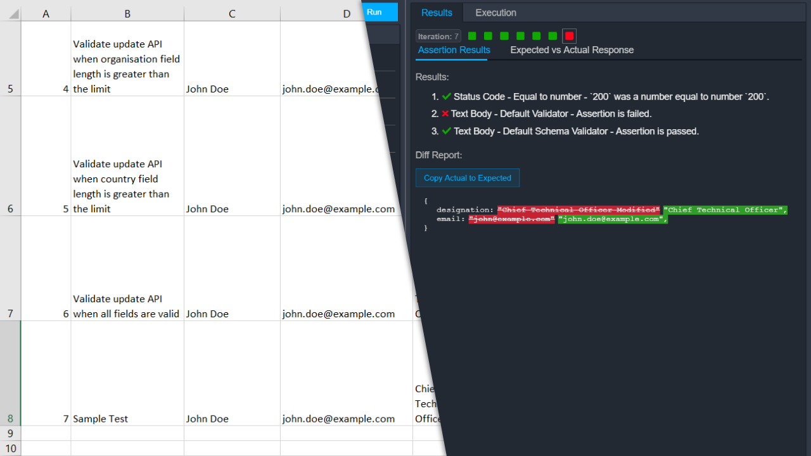

*(This is a sample test data repository for performing Data Driven Testing using csv files and vREST.)*

# Data Driven Testing (using vREST Desktop) 

vREST provides you the ability to perform one of the most productive approach in the world of testing. Data Driven Testing is an approach, which can save you a lot of time, effort, and other resources.

We have created this sample test data using which you can easily get started with Data Driven Testing, just by importing this as a Project in your vREST Desktop Workspace.

Let us see how you can do that,

## Step 1 - Clone this repository & Open this as a Project in vREST
* You can clone this repository and keep it anywhere you want in your system. 
* Once you have done that, you just have to open this repository in your vREST Workspace.
* Now, you can explore this Project on your own.

## Step 2 - Integrate Sample Data File (.csv) in vREST Desktop 
* Open Sample Data File
* Integrate with vREST Desktop for Live Editing

## Step 3 - Run Test Cases
* Run test cases.
